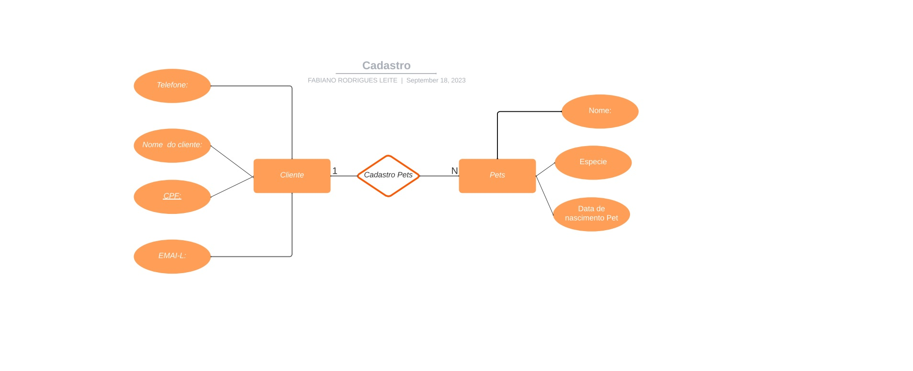
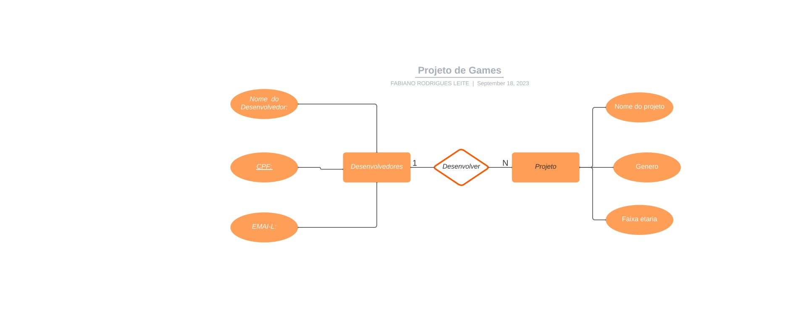

# Atividade individual - Lista de exercícios
## --------ETAPA 1-------
SLIDE 10 (NESTE EXERCÍCIO SERÁ OBSERVADO A IDENTIFICAÇÃO DOS ELEMENTOS DO DER (ENTIDADE/ATRIBUTOS/RELACIONAMENTO):
Crie um modelo de dados para os cenários a seguir:

1 - Um petshop deseja manter cadastrados seus clientes bem como seus pets.

2 - Em uma produtora de games, há desenvolvedores, que possuem um nome, CPF, data de nascimento.

## Última atualização 01/01/21
